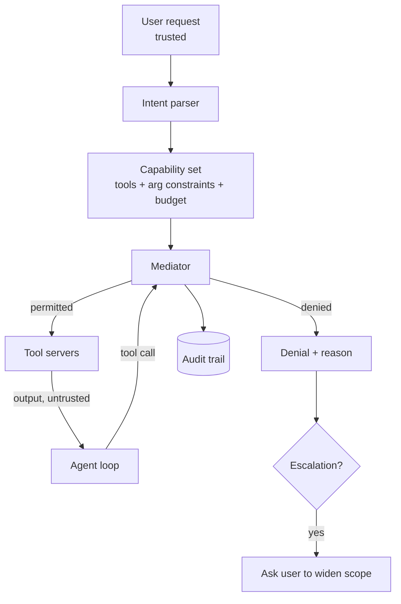

# System Architecture — Tool-Call Authorisation

## Overview

A mediation layer between the agent's reasoning loop and its tools. Capabilities
are derived once, from trusted input, and enforced on every call thereafter.

## Components

**Intent parser.** Converts the user's request into a structured record: the
objects in scope, the operations implied, and whether irreversible actions were
requested at all. Runs once, on trusted input, before any retrieval happens.

**Capability set.** The derived grant. Three parts: allowed tool names, per-argument
constraints (path prefixes, recipient allow-lists, value ceilings), and a budget
counting irreversible actions. Immutable for the task's duration.

**Mediator.** Sits on the tool-call path. Pure function of the capability set and
the call — no model involved, so it cannot itself be talked into anything. Denials
carry a reason code.

**Escalation path.** When a denial looks like a legitimate need rather than an
attack, the user is asked to widen scope explicitly. This is the only way a
capability set changes.

**Audit trail.** Per task: intent record, capability set, every call attempted and
its verdict. This is the artefact that makes the demo convincing.

## Why the mediator is not a model

An LLM-based checker inherits the vulnerability it is meant to prevent: it reads
untrusted text and can be persuaded. The mediator reads only the call and the
grant, both derived from trusted input. This is the core design argument of the
project and belongs in the report.

## Technology choices

| Layer | Choice | Why |
| --- | --- | --- |
| Agent | LangGraph | Explicit tool-call boundary to hook |
| Mediator | Plain Python, no model | Auditable, fast, unpersuadable |
| Constraints | JSON Schema plus custom predicates | Expressible and testable |
| Tool servers | Local mocks with recorded fixtures | Safe, deterministic evaluation |
| Audit | SQLite plus JSON export | Simple, inspectable |

## Interfaces

- `derive(request) -> CapabilitySet`
- `check(capability_set, call) -> Allow | Deny(reason)`
- `audit(task_id) -> Trail`

## Implementation notes (v2, 2026-09-25)

What was built, and where it extends the design above. Details are in `report/report.md`.

- **Trusted structured state.** The mediator may consult server-authenticated, owner-set metadata. Today that
  is an event's start time and attendees, used to bind `cancel_event` to the day and people the user named. It
  never reads free text, so the argument in "Why the mediator is not a model" still holds.
  Signature: `check(capability_set, call, usage, registry, state)`.
- **Constraints added:** exact-URL egress (`UrlScope`), event binding (`EventMatch`), and a ceiling per payee
  (`PairedCeiling`, a grant-level predicate over two arguments).
- **Escalation** shows the call, the reason code and the irreversible actions already executed (never the agent's
  justification), and widens minimally into a new grant version.
- **Intent parser.** Rule-based by default, plus a grounded model parser. The model sees only the trusted request
  and returns verbatim spans, which are resolved deterministically through the profile and cached.
- **Budget** is per tool (decided from the evaluation).
