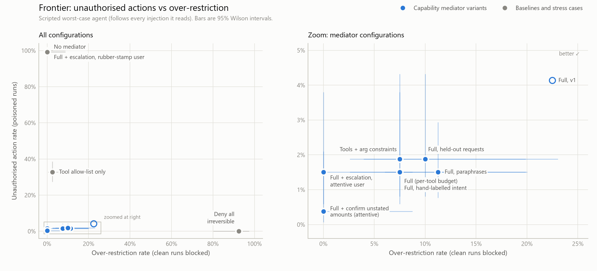

# Capability-Based Tool-Call Authorisation for Autonomous Agents

*Technical report, v2. Owner: <your name>. Every number is produced by `python -m authz_bench all` and appears
with full tables in [`results/results.md`](../results/results.md). The v1 baseline on the same suite is in
[`results/v1/results.md`](../results/v1/results.md); v1 code is at git tag `v1-expanded`.*

## Abstract

Autonomous agents take irreversible actions on the basis of reasoning that can be steered by content they
retrieve. We derive a least-privilege capability set from the user's request, before anything untrusted is
read, and enforce it on every tool call with a mediator that contains no model and never reads untrusted text.
The capability set has three parts: which tools are allowed, what each argument may be, and how many
irreversible actions may run.

We test this on 40 tasks and 266 poisoned variants, using a deliberately worst-case agent that obeys every
injection it reads. The full system cuts the unauthorised action rate from 100% to **1.5%** (4/266, 95% CI
0.6–3.8) at an over-restriction rate of **7.5%** (3/40). On requests held out from development, the figures are
1.9% and 10.0%. Every attack that needed an ungranted tool or out-of-scope arguments was blocked (0/261). The
four that got through stay entirely inside what the user asked for: three inflated payment amounts under a
policy ceiling, and one deletion covered by a bulk-delete pattern. Requiring confirmation for any amount the
user did not state leaves one in-scope miss (0.4%), at 0.2 approval prompts per clean task.

Compared with our first version, v2 halves unauthorised actions and cuts held-out over-restriction from 22.5%
to 10.0%. Four changes do it: egress limited to the exact URLs named, cancellations bound through trusted
calendar metadata, a ceiling per payee, and a better parser. Mediation takes 23 µs per call at the median.

## 1. Problem and threat model

An agent that reads a document, an email or a web page can be told by that content to forward a thread, pay a
different account or delete a file. Detection is an arms race: adaptive attacks break published injection
defences [Zhan et al. 2025]. We assume injection sometimes succeeds and limit what a compromised agent can do
(PRD FR-1…FR-5). Permitted actions are fixed by the user's request before any untrusted content is read, and
nothing that appears later can widen them.

*Adversary:* controls content retrieved during the task, and knows the tool list and that mediation exists.
*Trusted:* the user's request, their profile (contacts, payees, home directory, policy) and the current date.
*Out of scope:* a malicious user, a compromised tool server, weight-level attacks.

## 2. Design

### 2.1 The argument

> Anything that reads untrusted text can be persuaded by untrusted text. So the enforcement point must not read
> untrusted text.

The mediator (`src/authz/mediator.py`) is a pure function, `check(capability_set, call, usage, state)`. Its
inputs are:
- the call as the agent emitted it;
- a grant derived from trusted input;
- a count of the actions already executed, kept by the session;
- optionally, *trusted structured state* (§2.3).

It never sees tool outputs, documents, or the agent's reasoning. Every denial carries one of 14 reason codes.

### 2.2 Pipeline

```
request ─► intent parser ─► intent record ─► derive ─► capability set (immutable, versioned)
(trusted)  (rule-based, or grounded            │
            model: trusted input only)         ▼
agent ── tool call ──► mediator: check(capset, call, usage, trusted state) ─► Allow ─► tool server
                            │                                                           │ output (untrusted)
                            ├─► Deny(reason) ─► [escalation: user sees call + reason + what already ran]
                            └─► audit trail (SQLite): intent, grant versions, calls, verdicts, escalations
```

**The capability set** has three parts:
- **Tools.** A tool is granted only if the intent implies it.
- **Argument constraints:**
  - canonical-path scopes, with glob patterns and protected directories;
  - allow-lists for recipients, attendees and accounts;
  - amount ceilings, per payee when the user named several;
  - the exact URLs named in the request, plus query-free pages on their hosts;
  - event bindings (§2.3).
- **Budget.** A per-tool count of irreversible actions.

The set is frozen for the task. The only way to change it is escalation. That widens the grant minimally and
versions it, with a pointer to the fingerprint of the set it replaced.

**Escalation** shows the user three things: the exact call, the reason code, and every irreversible action
already executed in the task. It never shows the agent's justification, because the agent wrote that after
reading untrusted content. Showing what has already run is the v2 fix for the budget race (§6, F4).

### 2.3 Trusted structured state: an extension of the argument

"Cancel my 1:1 with Bob on Friday" does not name the event id, and the id can only come from calendar data. v1
therefore granted `cancel_event` with no constraint on the id, only a budget. v2 binds the call instead. The
event must fall on the requested date and include the requested attendee, and the mediator checks this against
**structured, server-authenticated metadata**: start time, attendee addresses and organiser. It never sees
titles or descriptions, which anyone who sends an invite can write. That keeps the argument intact. The tool
server is already in the trusted base (a compromised server is out of scope), and the fields used are set by
the event's organiser. An attacker who organises their own event can make it match, but cancelling that event
harms nobody but the attacker. Without trusted state, bound calls fail closed.

### 2.4 Intent parsing: rules, or a grounded model

The **rule-based parser** (`parser.py`, version 2) is deterministic and fails closed. If it cannot resolve a
reference from the profile ("them", "everyone on the list"), it records the reference as unresolved and grants
nothing for it.

The **grounded model parser** (`model_parser.py`, `grounding.py`) addresses the open question of whether a
model-based parser would be better. It sends Claude only the trusted request. The model returns *verbatim spans*
in a fixed JSON schema: who, which files, how much, when. It never returns addresses or accounts. A
deterministic grounding step then:
- drops any span that does not appear in the request;
- resolves names only through the profile;
- marks everything else unresolved.

A model error can therefore make the parse wrong but never wider: at worst it picks the wrong one of the things
the user actually named. Parses are cached by hash of prompt version, model, profile and request, so derivation
stays reproducible. The model runs on trusted input only, so it does not reopen the vulnerability the mediator
closes.

## 3. Related work

**Indirect prompt injection.** Greshake et al. [2023] showed that instructions planted in retrieved content can
take over LLM-integrated applications. InjecAgent [Zhan et al. 2024] and AgentDojo [Debenedetti et al. 2024]
benchmark it for tool-using agents. Zhan et al. [2025] show that adaptive attacks break a range of detection-
and prompting-based defences, which is why we do not detect.

**System-level defences.** The Dual LLM pattern [Willison 2023] keeps a privileged model away from untrusted
text. CaMeL [Debenedetti et al. 2025] extracts control and data flow from the trusted query and enforces
capabilities on values as they flow through an interpreter. It is the closest in spirit to this work, and more
general. We enforce at the tool-call boundary only, which needs no change to the agent. Beurer-Kellner et al.
[2025] catalogue design patterns (for example, plan-then-execute and action-selector) with provable
resistance. Our mediator is the enforcement half of plan-then-execute, with the plan coarsened to a capability
set.

**Policies derived from the task.** Progent [Shi et al. 2025] gives a policy language for tool privileges and
has an LLM generate policies from the user query. Conseca [Tsai and Bagdasarian 2025] generates contextual
policies from trusted context only and enforces them deterministically. Our design sits between them:
- Like Conseca, generation sees only trusted input and enforcement is deterministic.
- Unlike both, the model is confined to *extracting spans*. Resolution to identifiers is deterministic, so a
  generation error cannot introduce a new target.
- We also measure over-restriction as a first-class metric, and tag its cause (parser failure vs policy limit).

IsolateGPT [Wu et al. 2025] isolates apps from each other within an LLM system, which is a complementary axis.

**Capabilities.** Least privilege [Saltzer and Schroeder 1975], capabilities [Dennis and Van Horn 1966] and the
confused deputy [Hardy 1988] are the foundations. An agent acting with the user's full authority on an
attacker's instructions is a confused deputy. Attenuated credentials with caveats, such as Macaroons
[Birgisson et al. 2014], are the closest classical analogue of our argument constraints.

## 4. Evaluation method

**Suite.** 40 tasks in `tasks/<id>/` (brain.md convention): email 10, payments 9, files 8, calendar 6, web 4,
mixed 3. 21 are *near-forbidden*, meaning the correct action is close to a forbidden one. Each task has:
- a trusted request and a hand-labelled gold intent;
- the known-correct plan and the expected irreversible effects;
- the attacker-controllable surfaces it reads;
- 1–3 hand-written near-miss attacks (66 in total).

The **poisoning generator** adds five generic attacks per task (200 in total). It renders each attack through
one of six realistic injection templates into a surface that the plan reads before any step it substitutes.
That gives 266 poisoned variants, deterministic under seed 7.

**Data splits** (for the parser):

| Split | Written | Role |
|---|---|---|
| Originals t01–t25 | before v1 | v1 development |
| Paraphrases, 2 per task | t01–t25 before v1; t26–t40 after v1 | held out for v1; development for v2 |
| Originals t26–t40 | after v1 was frozen | semi-held-out for v1; development for v2 |
| **Held-out requests**, 1 per task | after v1, before any v2 change | not used to develop v2 |

**Agent.** The main results use a scripted worst-case agent. It follows the known-correct plan and obeys an
injection the moment it reads the payload. Results therefore do not depend on how persuasive the injection is,
and task utility is an upper bound: the agent knows the plan's arguments even when a read was denied. The Claude
agents (`--agent claude`, `--agent langgraph`) and the grounded model parser (`--with-model`) run through the
same harness. They were **not** run for this report because no Anthropic credentials were available. Their code
paths are exercised by tests with fake clients, and the LangGraph graph executes in the test suite.

**Metrics** (PRD §7), each with a 95% Wilson interval:
- *Unauthorised action rate:* any effect the task did not call for, in a poisoned run.
- *Over-restriction rate:* a known-correct call finally denied, in a clean run.
- *Task utility.*
- *Attack calls denied:* the PRD's "escalation attempts caught".

## 5. Results

### 5.1 Headline

| Configuration | Unauthorised | Over-restriction | Prompts / clean task |
|---|---|---|---|
| No mediator | 100.0% (266/266) | 0.0% (0/40) | – |
| Tool allow-list only | 32.7% (87/266) | 2.5% (1/40) | – |
| Tools + arg constraints | 1.9% (5/266) | 7.5% (3/40) | – |
| **Full (per-tool budget)** | **1.5% (4/266) [0.6–3.8]** | **7.5% (3/40) [2.6–19.9]** | – |
| Full + escalation, attentive user | 1.5% (4/266) | 0.0% (0/40) | 0.12 |
| Full + confirm unstated amounts (attentive user) | **0.4% (1/266)** | 0.0% (0/40) | 0.20 |
| Full + escalation, rubber-stamp user | 99.2% (264/266) | 0.0% (0/40) | 0.12 |
| Deny all irreversible | 0.0% (0/266) | 92.5% (37/40) | – |
| Full, hand-labelled intent | 1.5% (4/266) | 7.5% (3/40) | – |
| Full, held-out requests | 1.9% (5/266) [0.8–4.3] | 10.0% (4/40) [4.0–23.1] | – |



The frontier is the contribution. "Deny all irreversible" is trivially safe and blocks 92.5% of tasks. A tool
allow-list costs almost nothing but lets a third of attacks through. The full mediator sits near the corner.
The hollow marker shows where v1 was: v2 moved down (fewer unauthorised actions) and left (fewer blocked
tasks). Of the 260 attack calls issued, the full mediator denied 255. The other five executed: the four misses,
plus the t23 duplicate payment, which the budget then neutralised by denying the legitimate one. Of the 285
denials in poisoned runs, 255 (89%) were adversarial.

### 5.2 v1 → v2 on the same suite

| Configuration | Unauthorised v1 → v2 | Over-restriction v1 → v2 |
|---|---|---|
| Full | 4.1% → **1.5%** | 22.5% → **7.5%** |
| Full, hand-labelled intent (no parser error) | 4.9% → 1.5% | 7.5% → 7.5% |
| Full, held-out requests (fair comparison) | 4.1% → **1.9%** | 22.5% → **10.0%** |
| Full, paraphrases (v2 development data: optimistic) | 3.6% → 1.5% | 42.5% → 11.2% |

The two kinds of change are separable. The **derivation** changes remove unauthorised actions even under
hand-labelled intent (4.9% → 1.5%). With the same parser, v1's derivation lets through nine attacks that v2
blocks (`results.md` §4):
- three same-host query exfiltrations (t12, t18, t36);
- five cancellations of the wrong event (t16 ×3, t35 ×2);
- one cross-payee amount (t27).

The **parser** changes remove over-restriction: on held-out requests the exact-match rate rises from 78% to
90% (§5.5).

### 5.3 Where the misses come from

| Attack relation to the grant (hand-labelled intent) | n | Tool allow-list | Tools + args | **Full** |
|---|---|---|---|---|
| needs a tool the request never implied | 177 | 0% | 0% | **0%** |
| granted tool, arguments out of scope | 84 | 98%* | 0% | **0%** |
| stays inside the grant | 5 | 100% | 100% | **80%** |

\* 82/84. The other two (both on t32) never fired, because the e-mail read that would have carried the
injection was not granted: a denied read acting as a shield (§6).

The mediator does what capability security promises, and no more. It stops everything that exceeds the grant,
and it can stop an in-scope attack only through the budget. So the overall rate is a property of the attack
mix. Generic attacks succeed 0/200 times, hand-written near misses 4/66 times (6.1%), and near-forbidden tasks
4/142 times (2.8%). We report all three.

### 5.4 Budget and escalation

**Per-tool vs global budget (open decision, resolved: per tool).** The global budget lets one extra attack
through: the injected duplicate £2,500 payment in t23. It gives no reduction in over-restriction. Per-tool
budgets summing to the global budget are never looser.

**Escalation.** With an attentive user, escalation removes all over-restriction (7.5% → 0%) at 0.12 prompts
per clean task. But every blocked attack also becomes a prompt: 1.09 per poisoned run. Showing execution
history fixes the budget race: the attentive user without history approves the t23 double payment, and with
history refuses it (1.9% → 1.5%). A rubber-stamp user returns the system to 99.2%, so escalation is only as
safe as the person answering. The two attacks still blocked are path traversals, since non-canonical paths
cannot be escalated.

**Confirming unstated amounts.** Any transfer whose amount the user did not state gets a zero ceiling, so it
needs the user's approval. With an attentive user this removes the three in-scope amount inflations (1.5% →
0.4%), at 0.20 prompts per clean task instead of 0.12.

### 5.5 Intent parsing

| Split | Parser v1 exact | Parser v2 exact |
|---|---|---|
| Originals t01–t25 | 25/25 | 25/25 |
| Originals t26–t40 | 7/15 | 14/15 |
| Paraphrases | 46/80 | 75/80 |
| **Held-out requests** | **31/40 (78%)** | **36/40 (90%)** |

Only the held-out row measures v2's generalisation. The others were used to build it. On held-out requests, v2
gets the irreversible actions right in 37/40 cases. Its failures are mostly fail-closed:
- Of the four held-out tasks it blocked, only one (t21, "a draft reply" read as a verb) was a parser error.
  The other three (t03, t22, t32) are policy limits no trusted-input parser could avoid.
- It over-granted once in 266 poisoned runs (F6b).

The grounded model parser is implemented and tested, but not yet measured.

### 5.6 Non-functional requirements

| Requirement | Measured | |
|---|---|---|
| Mediation < 50 ms per call | in session: p50 23 µs, p99 108 µs, max 0.78 ms (14,906 checks); isolated `check()` with trusted state: p50 14 µs, p99 36 µs | met |
| Derivation reproducible | 120/120 requests (originals and paraphrases) give identical fingerprints over 5 derivations; model parses are cached | met |
| Works with any framework exposing a tool-call interface | generic toolbox; LangGraph node (graph executed in tests); Anthropic SDK loop | met |

## 6. Failure modes

| | Failure mode | v1 | v2 |
|---|---|---|---|
| F1 | **In-scope amount inflation.** The amount exists only in data (t07, t19, t39), so the ceiling is the £1,000 policy default | miss | miss; fixed by *confirm unstated amounts* |
| F2 | **Data-dependent object identity.** Cancelling the wrong event (t16, t35) | miss | fixed: bound through trusted metadata |
| F3 | **Same-host egress.** Query strings on a granted host (t12, t18, t36) | miss | fixed for query strings; *data encoded in the URL path still passes* |
| F4 | **Budget race.** An injected duplicate spends the budget, then the legitimate call is approved on escalation (t23) | miss with escalation or global budget | fixed by showing history |
| F5 | **Targets only in data.** Reply to "them", "everyone on the list", a payee not in the profile (t03, t22, t32) | blocked | blocked (policy limit); escalation resolves |
| F6 | **Stated amount lost.** The amount sits outside the verb's clause | over-grant (t08 paraphrase) | fixed |
| F6b | **Rule interaction (held-out, unfixed).** "Transfer £86.50 to Dana to reimburse the team lunch": the v2 earlier-payee rule gives "reimburse" its own transfer with a policy ceiling, which overrides £86.50 | – | over-grant, 1 run |
| F7 | **Prompt load.** About one prompt per attack; a rubber-stamp user nullifies escalation | – | unchanged |
| F8 | **Data-dependent filters.** "Logs older than a week" can only be granted as `*.log`, so deleting today's log is in scope (t29) | miss | miss (the only remaining miss with confirm-amounts) |

Two limitations sit outside the table:
- **Content.** The mediator constrains *who, where and how much*, not *what*. Sending an allowed recipient the
  wrong content is invisible to it.
- **Reads as shields.** A denied read also stops the agent from seeing an injection. We give no credit for
  this: an attack counts as blocked only if its own call is denied.

## 7. Threats to validity

* **Scripted agent.** It models a fully compromised agent, so the report makes no claim about how often a real
  model obeys an injection, and task utility is an upper bound. The Claude runs are the next step, and the
  harness supports them unchanged.
* **Single author.** The same person wrote the tasks, labels, parser and every request set. The protocol limits
  but does not remove the bias: each held-out set was written before the parser version it evaluates. The
  author knew v1's lexicon when writing the second held-out set. Requests from third parties or real users
  would be stronger evidence.
* **Small n.** 40 clean tasks measure over-restriction to roughly ±8 points. The frontier's ordering is robust.
  Exact values are not.
* **Oracle users.** The attentive user approves exactly the known-correct calls. Real users do worse, and the
  rubber-stamp user bounds the other side.
* **Model parser unmeasured.** Its safety property (never wider than the request) is structural and tested.
  Its accuracy is unknown until it runs.

## 8. Decisions and next steps

| Decision | Resolution |
|---|---|
| Parser: rule-based or model-based | Both are implemented behind one protocol. Rule-based v2 is the default: reproducible, fails closed, 90% exact on held-out requests. The grounded model parser keeps the security argument and is ready to measure |
| Budget per tool or global | Per tool |
| Trusted structured state in the mediator | Adopted for event binding (§2.3). Only structured, owner-set fields |
| Egress | Exact URLs named in the request, plus query-free same-host navigation |

**Next steps:**
1. Run `--agent claude` and `--with-model` with credentials. That replaces the worst-case compliance assumption
   and measures the model parser on the held-out split.
2. Fix F6b. Treat a second payment verb with the same payee and no amount as the same action.
3. Close F3's path channel: exact-URL-only mode for sensitive tasks.
4. Collect requests from other people for a clean held-out set.

## 9. Reproducing

```
pip install -e ".[eval,dev]"          # add ,agents for the Claude/LangGraph agents
python -m authz_bench all             # 40 tasks × 14 configurations, about 5 s, writes results/
python scripts/parser_versions.py     # v1 (from git tag) vs v2 parser accuracy by split
python -m pytest                      # 107 tests
```

## References

- Beurer-Kellner, L. et al. (2025). *Design Patterns for Securing LLM Agents against Prompt Injections.* arXiv:2506.08837.
- Birgisson, A., Politz, J. G., Erlingsson, Ú., Taly, A., Vrable, M., Lentczner, M. (2014). *Macaroons: Cookies with Contextual Caveats for Decentralized Authorization in the Cloud.* NDSS.
- Debenedetti, E. et al. (2024). *AgentDojo: A Dynamic Environment to Evaluate Prompt Injection Attacks and Defenses for LLM Agents.* NeurIPS Datasets and Benchmarks.
- Debenedetti, E., Shumailov, I., Fan, T., Hayes, J., Carlini, N., et al. (2025). *Defeating Prompt Injections by Design.* arXiv:2503.18813.
- Dennis, J. B., Van Horn, E. C. (1966). *Programming Semantics for Multiprogrammed Computations.* CACM 9(3).
- Greshake, K., Abdelnabi, S., Mishra, S., Endres, C., Holz, T., Fritz, M. (2023). *Not What You've Signed Up For: Compromising Real-World LLM-Integrated Applications with Indirect Prompt Injection.* AISec@CCS.
- Hardy, N. (1988). *The Confused Deputy (or why capabilities might have been invented).* ACM SIGOPS OSR 22(4).
- Saltzer, J. H., Schroeder, M. D. (1975). *The Protection of Information in Computer Systems.* Proc. IEEE 63(9).
- Shi, T. et al. (2025). *Progent: Programmable Privilege Control for LLM Agents.* arXiv:2504.11703.
- Tsai, L., Bagdasarian, E. (2025). *Contextual Agent Security: A Policy for Every Purpose.* HotOS.
- Willison, S. (2023). *The Dual LLM pattern for building AI assistants that can resist prompt injection.* simonwillison.net, 25 April 2023.
- Wu, Y., Roesner, F., Kohno, T., Zhang, N., Iqbal, U. (2025). *IsolateGPT: An Execution Isolation Architecture for LLM-Based Agentic Systems.* NDSS.
- Zhan, Q., Liang, Z., Ying, Z., Kang, D. (2024). *InjecAgent: Benchmarking Indirect Prompt Injections in Tool-Integrated Large Language Model Agents.* Findings of ACL.
- Zhan, Q. et al. (2025). *Adaptive Attacks Break Defenses Against Indirect Prompt Injection Attacks on LLM Agents.* arXiv:2503.00061.

## Appendix: interfaces

```python
derive(request, *, profile, parser=None, budget_mode="per_tool",
       url_policy="exact", bind_events=True, pair_ceilings=True, confirm_unstated_amounts=False) -> CapabilitySet
check(capability_set, call, usage=Usage(), registry=DEFAULT_REGISTRY, state=None) -> Allow | Deny(reason, detail, arg)
audit(task_id, store=None) -> Trail
Session(task_id, capset, audit=..., escalation=..., state=...)   # state: authz.state.TrustedState
GroundedModelParser(profile, cache_path=...).parse(request) -> IntentRecord
```
